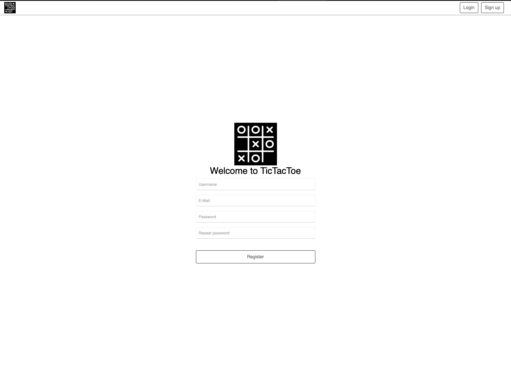
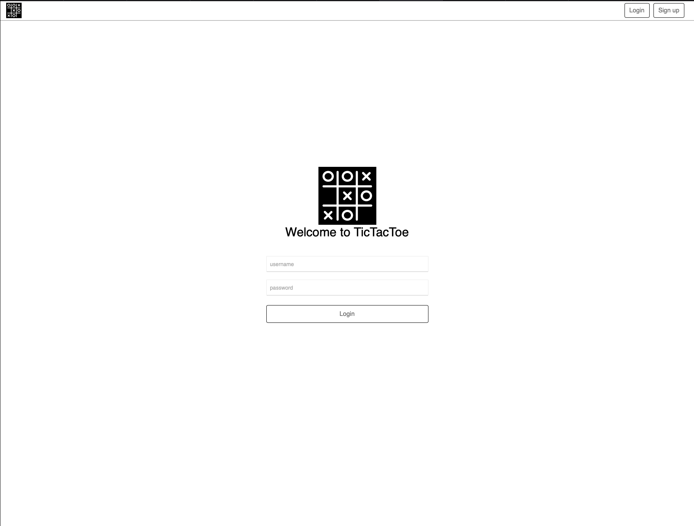
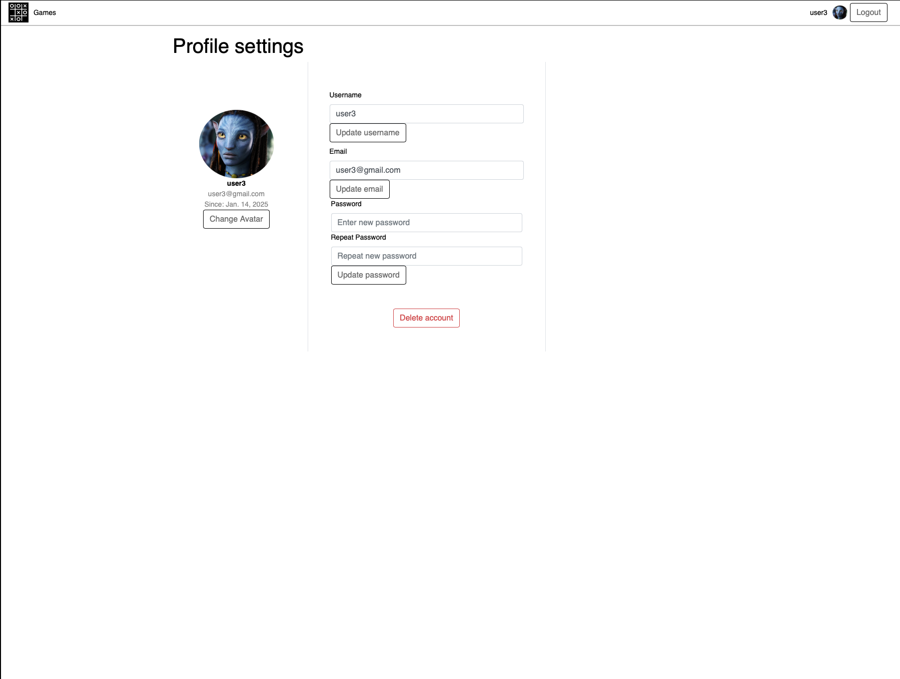
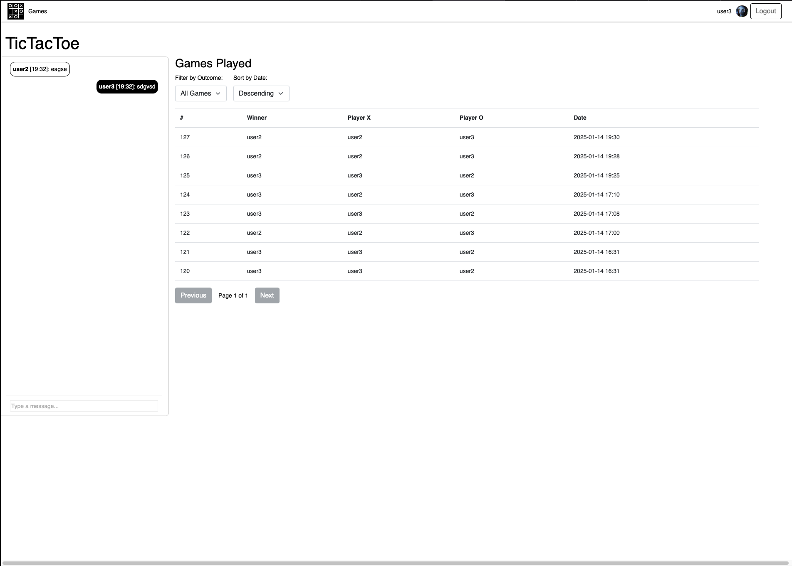
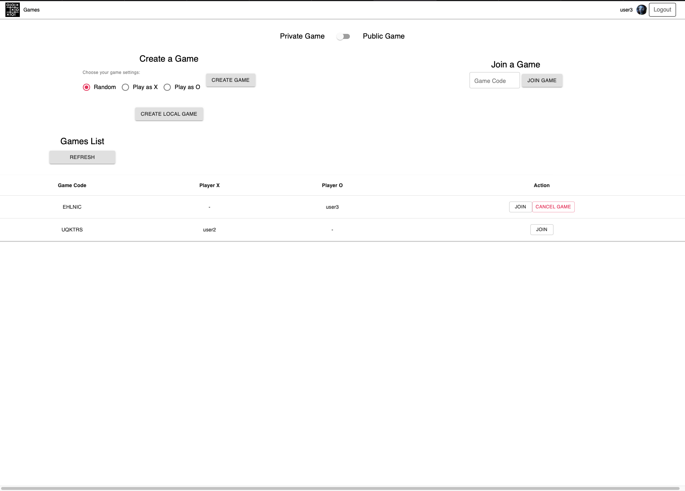
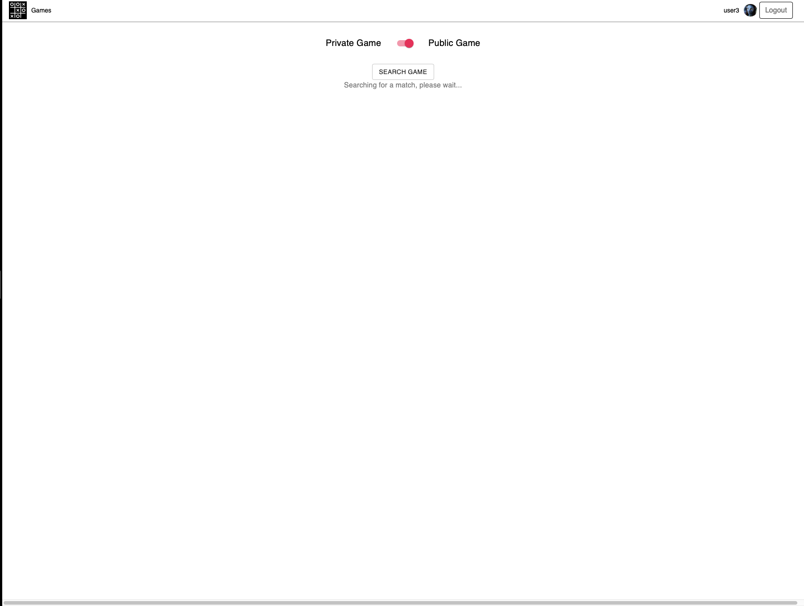
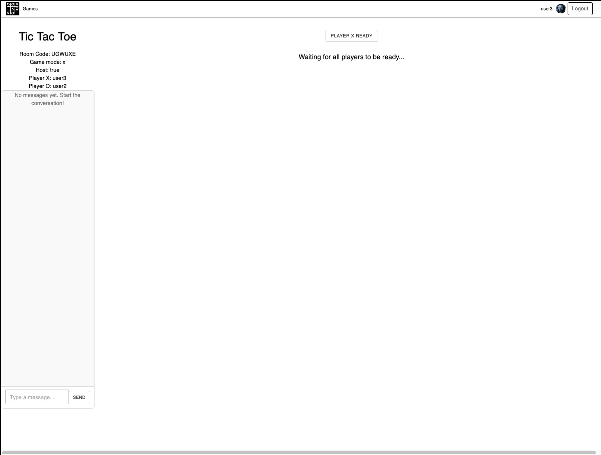
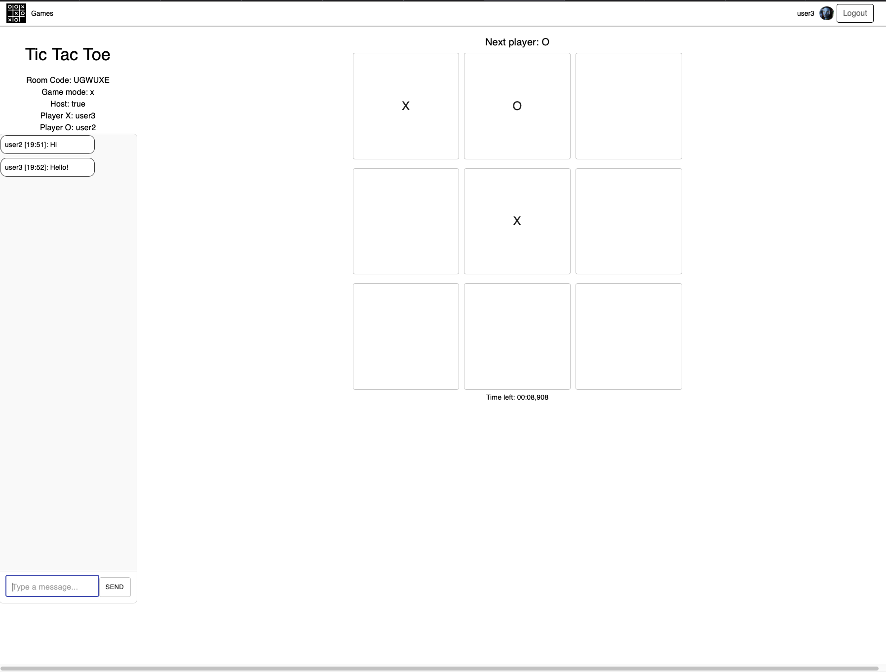

# TicTacToe-WebSockets-Django-React

This is a full-stack web application built with Django (Backend), a mix of traditional HTML/CSS and React (Frontend), and WebSockets. The frontend combines static HTML and CSS with dynamic React components that fetch data from APIs. The app features real-time interactions, game management, and communication, utilizing various modern technologies.
## Key Technologies Used

- **Django**: Backend framework that provides the core of the application logic.
- **React**: Frontend library used to build interactive UI components.
- **WebSockets**: Used for real-time communication between the server and the client.
- **PostgreSQL**: Relational database to store user data, chat history, and game state.
- **Celery**: Task queue for asynchronous processing and background jobs.
- **Redis**: In-memory data store used for caching, e.g., for the latest chat messages.
- **Docker Compose**: Containerizes the application into six services for easy orchestration.
- **nginx**: Web server acting as a reverse proxy to handle HTTPS and WebSocket connections.

## Features

- **Real-Time Chat**: A dynamic chat feature where users can communicate in real-time using WebSockets.
- **Real-Time Game**: A real-time game feature where players can join, play, and interact during the game session, with updates pushed via WebSockets and game state stored in Redis.
- **Game Search Queue**: Users can find and join game queues in real-time using WebSockets.
- **File Upload**: Support for file uploads as part of user interactions or game content.
- **Account Management**: Allows users to manage their accounts, including changing their nickname and password.
- **Table Sorting**: Provides sortable tables for displaying user data and statistics.
- **API Endpoints**: Exposes various endpoints for interacting with the backend (e.g., retrieving game data, posting chat messages).
- **JWT Authentication**: The API uses JSON Web Tokens (JWT) for stateless user authentication.
- **Session Authentication**: For normal user login, Django’s built-in session authentication is used.
- **Security**: Implemented various security headers such as Strict-Transport-Security, X-Content-Type-Options, X-Frame-Options, and X-XSS-Protection for better application security.
- **Custom Middleware**: Custom middleware to enhance or modify request/response handling.
- **Unit Tests**: Includes unit tests to ensure the correctness of the core functions, using assertions for validation.

## Architecture

The project is a mix of **WSGI** and **ASGI** components:

- **WSGI**: Traditional part of the Django app that handles requests for regular views, forms, etc.
- **ASGI**: Used for real-time features like chat, game search queue, and game itself. This part of the app communicates using WebSockets.

### Daphne

Django runs with **Daphne**, an HTTP/WebSocket protocol server that works with ASGI, which is essential for handling real-time communication.

### Docker Compose

The project is containerized using **Docker Compose** with the following services:

- **web (Django)**: The main web application, running with **Daphne** as the ASGI server.
- **db (PostgreSQL)**: Database for storing persistent data.
- **nginx**: Web server acting as a reverse proxy for serving the app with HTTPS.
- **redis**: Used for caching chat messages and other quick-access data.
- **celery**: Handles background tasks using Celery workers.
- **celery_beat**: Schedules periodic tasks for long-running jobs.

### HTTPS with Self-Signed SSL Certificate

The application is served over **HTTPS** with a self-signed SSL certificate, ensuring secure communication over the network.

## Authentication & Authorization

- **JWT Token Authentication**: The API uses **JSON Web Tokens (JWT)** for authentication. Users authenticate via a login form or token-based authentication.
- **Django Session Authentication**: For non-API use cases, Django's built-in session-based authentication is utilized.
- **Authorization**: Uses Django’s built-in permissions and decorators to manage user access to specific resources.

## .env Files

The project uses environment variable configuration via **.env** files to manage different configurations for development, production, and other environments.

## Security

The application has implemented various security measures to protect user data:

- **Strict-Transport-Security**: Ensures HTTPS is used for all connections.
- **X-Content-Type-Options**: Prevents content sniffing, helping to mitigate certain types of attacks.
- **X-Frame-Options**: Protects against clickjacking attacks.
- **X-XSS-Protection**: Provides protection against cross-site scripting attacks.

# Project install Docker Test/Production environment
1. Create ".env.prod" in root folder:  
"# Django settings"  
DJANGO_SECRET_KEY=YOUR_SECRET_KEY  
DEVELOPMENT_MODE=False  
DEBUG=False  
ALLOWED_HOSTS=YOUR_ALLOWED_HOSTS  
 
"# Database settings"
SQL_ENGINE=django.db.backends.postgresql  
SQL_DATABASE=tictactoe_prod  
SQL_USER=admin  
SQL_PASSWORD=tictactoe  
SQL_HOST=db  
SQL_PORT=5432  
DATABASE=postgres  

"# CORS"  
CORS_ALLOWED_ORIGINS=YOUR_ALLOWED_ORIGINS(HTTPS),YOUR_ALLOWED_ORIGINS(HTTPS),YOUR_ALLOWED_ORIGINS(HTTPS), (without spaces!)  
CSRF_TRUSTED_ORIGINS=YOUR_TRUSTED_ORIGINS(HTTPS),YOUR_TRUSTED_ORIGINS(HTTPS),YOUR_TRUSTED_ORIGINS(HTTPS), (without spaces!)  

"# Redis"
REDIS_HOST=redis
REDIS_PORT=6379
REDIS_DB=0

2. Create .env.prod.db in root folder:  
POSTGRES_USER=admin  
POSTGRES_PASSWORD=tafel  
POSTGRES_DB=tafel_prod  

3. Set the right port in nginx/nginx.conf, docker-compose..

4. Build and run for prod:  
docker-compose -f docker-compose.prod.yml up -d --build
 
or  
Build and run for test:  
docker-compose -f docker-compose.yml up -d --build
5. With the help of:  
docker-compose -f docker-compose.prod.yml exec web COMMAND 
execute commands if you needed or just modify entrypoint.sh abd entrypoint.prod.sh:  
- python manage.py flush --no-input
- python manage.py migrate

- python manage.py collectstatic --no-input

- python manage.py loaddata apps/core/fixtures/*
- (CHANGE EXAMPLE CREDENTIALS!!! Example command for user creation): python ./manage.py shell -c "from apps.accounts.models import User; user = User.objects.create_superuser('ADMIN_USERNAME', 'ADMIN_EMAIL@EXAMPLE.COM', 'ADMIN_PASSWORD');"

### Commands for Docker-Compose
Get in Docker-compose:
docker-compose -f docker-compose.prod.yml exec web bash

Logs:
docker-compose logs -f

Delete container:
docker-compose -f docker-compose.prod.yml down -v

Build and run:
docker-compose -f docker-compose.prod.yml up -d --build

Execute command via dockee-compose:
docker-compose -f docker-compose.prod.yml exec web python manage.py migrate --noinput

Check volume info
docker volume inspect djnager_postgres_data

Log in to DB:
docker-compose exec db psql --username=admin --dbname=tictactoe_prod or tictactoe_dev

In DB:
- List of DB: *\l*
- Connected to database: *\c djnager_dev*
- List of relations: *\dt*
- Exit: *\q*

# Screenshots

---
Oleksandr Kamenskyi  
Berlin